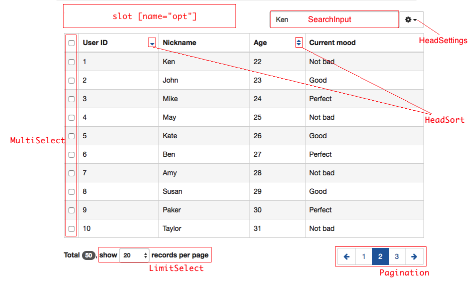

# Vue Date Table Component

[![npm version][npm-v-img]][npm-url]
[![npm download][npm-dl-img]][npm-url]

> Intellectual property of [Oneway.mobi](http://www.oneway.mobi/)

#### Notice
This component is not meant to fit all the business requirements  
so diving into `src/` to make it meets your needs is highly recommended

#### Example
See [here](https://kenberkeley.github.io/vue-datatable-component/example), the source is in `example/`

#### Requirement
* Vue 1.x
* Vue Router 0.7.x
* [vue-update-query-mixin](https://github.com/kenberkeley/vue-update-query-mixin)
* [vue-sync-query-mixin](https://github.com/kenberkeley/vue-sync-query-mixin)
* Lodash 4.x
* jQuery + BootStrap 3.x (available globally)

#### Installation
`npm i vue-datatable-component -S`

> alternatively: `<script src="dist/vue-datatable-component.min.js"></script>`  
> which exposes **`VueDataTable`** as a global variable

#### Composition

> `HeadSort` / `LimitSelect` / `Pagination` / `SearchInput` will keep in sync with `$route.query`

```
src/DataTable
├── HeadSort            // sortBy={String} order=asc|desc
│   ├── index.vue
│   └── mixin.js
├── HeaderSettings.vue
├── LimitSelect.vue     // limit={Number||10}
├── MultiSelect
│   ├── index.vue
│   └── mixin.js
├── Pagination.vue      // offset={Number||0}
├── SearchInput.vue     // search={String}
└── index.vue
```



#### Configuration

```
@prop columns: { type: Array, required: true }
  columns[i].field         // {String}, required
  columns[i].title         // {String}, required
  columns[i].sort          // {Boolean||false}, is it sortable?
  columns[i].component     // {String}, name of the table-cell-component
  columns[i].defaultHidden // {Boolean||false}

@prop data: { type: Array, required: true }

@prop total: { type: Number, required: true }
// total number of records, instead of total records number per page (which named `limit`)

@prop checkedIds: { type: Array, twoWay: true }
// if component `MultiSelect` is enabled, this prop must be passed a `[]` in `.sync` mode

@prop config: { type: Object, default: () => ({}) }
  // child components enabler
  config.multiSelect    // {Boolean||true}
  config.headerSettings // {Boolean||true}
  config.limitSelect    // {Boolean||true}
  config.pagination     // {Boolean||true}
  config.searchInput    // {Boolean/String||true} string type would be applied to `placeholder`
  
  config.idField        // {String||'id'} specify the key field

@slot opt
```

```
// table-cell-component accessible props
@prop row: { type: Object, twoWay: true }
@prop field: { type: String }
@prop value: { type: Any }
```

#### Build

`npm run build`

#### LICENSE

MIT

[npm-url]: https://www.npmjs.com/package/vue-select2-component
[npm-v-img]: http://img.shields.io/npm/v/vue-select2-component.svg
[npm-dl-img]: http://img.shields.io/npm/dm/vue-select2-component.svg
